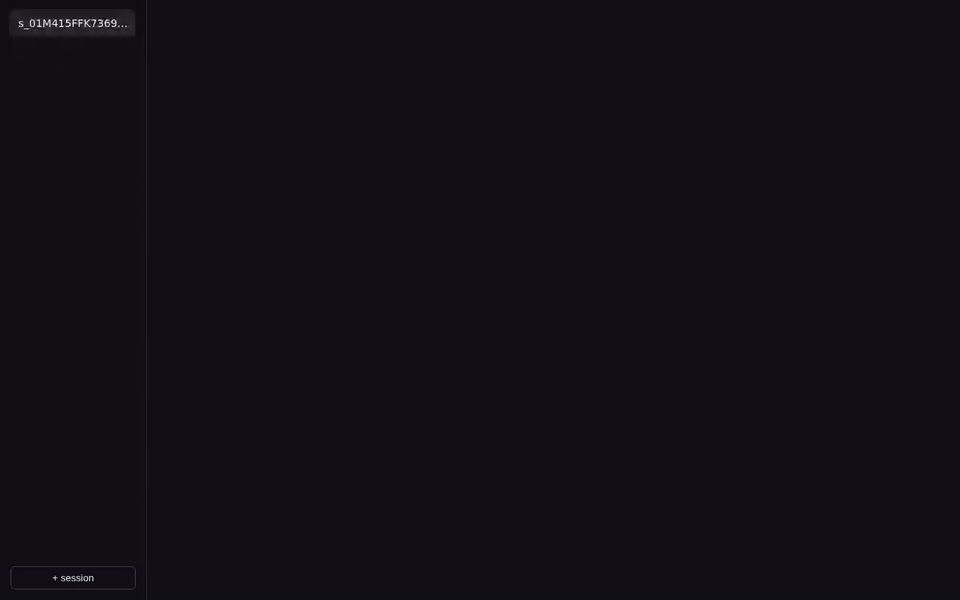

<div align="center">

# Lararium

*/ lārārium / — the household shrine where the protective spirits were kept*

**A personal AI agent that lives at your hearth and rides in your pocket.**
Your machine, your models, your keys.

[](https://github.com/lararium-app/lararium/actions/workflows/ci.yml)
[](LICENSE)

[Website](https://lararium.io) · [Docs](docs/) · [Security](SECURITY.md) · [Contributing](CONTRIBUTING.md)



*`hearthd serve` — the browser door. One command, one token, one real conversation.*

</div>

---

Lararium is an open-source, self-hosted AI agent daemon (`hearthd`). It
runs on hardware you own, remembers everything in plain files you can
read and edit, points at model providers you choose, and reaches you on
the screens you already carry.

## The covenant

- **Your fire** — bring your own llama.cpp on your own silicon, or an API
  key for any major provider. No lock-in, no hidden routing.
- **Your memory** — everything the agent knows lives in plain text files
  ([Penatus](docs/PENATUS-SPEC.md)). Export your whole life with one `tar`.
- **Your keys** — credentials are vaulted and never shown to the model;
  the network layer injects them, policy-checked, on the way out.
  *(Planned.)*
- **Sandboxed work** — agent work executes inside cells
  ([CELL-SPEC](docs/CELL-SPEC.md)): systemd-nspawn + cgroup2 + overlayfs,
  fail-closed networking, hard resource caps, snapshot/rollback. The
  threat model assumes prompt injection *succeeds*; the cage makes
  misbehavior physically expensive below the model.

## Status: public preview (v0.5.0-alpha)

> [!WARNING]
> Lararium is **pre-1.0 alpha**. The file formats are specified and frozen
> per-component; the wire APIs may still change between releases. Run it on
> machines you can wipe. Not fit for production or multi-tenant use.

**Working today:** the `hearthd` REPL (append-only event log, context
compaction, memory tools) · model routing with fallback chains (any
OpenAI-compatible endpoint — llama.cpp, Ollama, vLLM, OpenRouter, OpenAI,
Anthropic-compat) · Penatus memory · `hearthd
serve` — HTTP/SSE API + built-in web chat with streaming and clickable
tool approvals · **Telegram** (`nuntius`): one-owner bridge with
pairing codes, streaming replies, and approval cards that resolve
from the phone · the `cell` sandbox, proven by a C1–C12 containment
suite on five hosts across two architectures · **the credential vault
(`custos`)**: `custosd` holds OAuth credentials sealed at rest; a Gmail
connector sends through a policy gate (auto / ask / deny) over an
isolated worker lane the agent can never read from, with an append-only
audit chain — verified live end-to-end (consent → sealed refresh token
→ policy-checked send → audit line) · **the standalone approval door**:
`custos approvals` lists pending cards and answers them Allow-once or
Deny from the owner's terminal, so `ask` verdicts are decidable with no
`hearthd` running. See [CUSTOS-SPEC.md](docs/CUSTOS-SPEC.md).

**Not built yet:** other messaging channels (Signal, …); the
`hearthd`↔`custosd` integration that fans vault approval cards to
web/Telegram (standalone `custosd` answers them on the control socket
via `custos approvals`, per CUSTOS-SPEC §6.4a; an unanswered `ask`
still holds its timeout window and denies with a clean, audited
`denied: approval`); the Docker quick start does not
include `custosd` yet.
[ARCHITECTURE.md](docs/ARCHITECTURE.md) maps the whole shape.

## Platforms

| Platform | Daemon | Sandbox |
|---|---|---|
| Linux (native) | ✅ | ✅ full cage — the reference target |
| WSL2 (Windows 11) | ✅ | ✅ full cage — enable systemd, one package line |
| Windows / macOS native | ✅ compiles clean | ❌ cage needs a Linux kernel (or hypervisor backend, planned) — Docker door meanwhile |

The cage is built on kernel features (`systemd-nspawn`, nftables,
overlayfs, cgroup2), not distro-specific glue — it has run green on
x86-64 and arm64, three distro families, ext4 and btrfs, bare metal and
WSL2. On Windows the answer is WSL2: set `[boot] systemd=true` in
`/etc/wsl.conf`, install `uidmap systemd-container nftables acl
debootstrap`, and the cell stack behaves exactly as on bare metal.

## Quick start

**Bring your own model.** Lararium talks to any OpenAI-compatible
endpoint — a llama.cpp / Ollama / vLLM / LM Studio server on your own
machine, or a hosted key from OpenRouter, OpenAI, Anthropic, &c. There
is no default provider and no account of ours in the loop.

The supported way to run the alpha is Docker Compose:

```bash
git clone https://github.com/lararium-app/lararium.git
cd lararium/docker
docker compose up --build
```

The reference config points at a model server on **your** machine
(`http://host.docker.internal:8080/v1`) — serve any model there with
llama.cpp (or point the reference config at yourself) and it just works,
key-free. Prefer a hosted endpoint? Uncomment one provider block in
`docker/config/lararium.yaml`, export its key, and pass it through:

```bash
OPENAI_API_KEY=*** docker compose up --build
```

Keys come from your environment only — nothing secret is baked into the
image or committed to this repo.

Compose serves the web chat on `http://127.0.0.1:7717`. To open a door
to it:

```bash
docker compose exec hearthd hearthd token create me
```

The command prints a ready URL to open in a browser (shown once).

Build from source with Go 1.25+ (`go build ./cmd/hearthd && go test
./...`); run `./hearthd` for the REPL or `./hearthd serve` for the web
door. Native Linux/WSL2 installs additionally get the `cell` sandbox —
see [CELL-SPEC.md](docs/CELL-SPEC.md) for the host requirements and
`cell doctor` to check yours.

## Documentation

| Document | What it freezes |
|---|---|
| [ARCHITECTURE.md](docs/ARCHITECTURE.md) | Component map, data flow, design principles |
| [PENATUS-SPEC.md](docs/PENATUS-SPEC.md) | The on-disk memory formats |
| [CELL-SPEC.md](docs/CELL-SPEC.md) | The sandbox contract (nspawn + cgroup2 + nftables) |
| [SURFACE-SPEC.md](docs/SURFACE-SPEC.md) | The HTTP/SSE API and web chat security model |

## What Lararium is *not*

- **Not a cloud service.** There is no hosted backend; if a repo or site
  claims to be "official Lararium cloud", it isn't us.
- **Not a multi-tenant platform.** One household, one owner. The security
  model is single-trust-domain by design.
- **Not a model zoo.** Lararium orchestrates inference; it does not ship,
  train, or endorse models.

## Contributing

Start with [CONTRIBUTING.md](CONTRIBUTING.md). Bug reports and feature
proposals go through the [issue templates](https://github.com/lararium-app/lararium/issues/new/choose).
By participating you agree to the [Code of Conduct](CODE_OF_CONDUCT.md).

## License

Lararium is licensed under the **GNU AGPL-3.0-only** — see [LICENSE](LICENSE).

In short: you may run, study, modify, and share Lararium freely, including
commercially *as self-hosted software*. If you run a modified version as a
network service, the AGPL requires you to offer its source to your users.

**Commercial licensing:** entities that want to embed Lararium in
closed-source products or appliances may obtain a proprietary license from
the project. Self-hosting, personal use, and open-source contributions are
not affected — this clause exists to keep the project funded, not to gate
the community.

© 2026 The Lararium authors.
